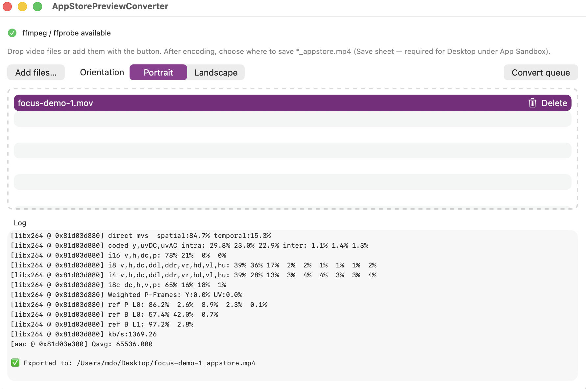

# App Store Preview Converter

macOS SwiftUI utility that turns screen recordings (typically **QuickTime `.mov`**) into **`.mp4`** files aligned with Apple’s [App preview specifications](https://developer.apple.com/help/app-store-connect/reference/app-preview-specifications/) for upload in App Store Connect.

The heavy lifting is done by **`appstore_convert.sh`** (bundled `ffmpeg` / `ffprobe`); the app provides a small queue UI, sandbox-safe export, and bundled encoders.



---

## Features

- **Queue & import** — Add files via drag-and-drop or the file picker; convert the queue one after another.
- **Orientation** — **Portrait** or **landscape** for **6.5" iPhone** preview dimensions (886×1920 or 1920×886 with letterboxing / pillarboxing as needed).
- **App Store–oriented encode** (script-driven):
  - **Duration** — Output kept in the **15–30 second** window: sources longer than 30s are trimmed; shorter clips are padded (clone last frame) to meet the **15s minimum**.
  - **Video** — H.264 **High@Level 4.0**, ~**10–12 Mbps** target band, **30 fps CFR**, **yuv420p**, BT.709 color tags, **`setsar=1`** (square pixels).
  - **Audio** — **AAC 256 kbps**, **48 kHz stereo** (silent stereo if the source has no usable audio track).
  - **Container** — MP4 with **`faststart`** for streaming-friendly layout.
- **Two-pass x264** — Pass logs written under **`$TMPDIR`** so encoding works under the App Sandbox.
- **Sandbox-friendly export** — Encode to a temp file, then **`NSSavePanel`** so the user picks a destination (needed for reliable writes outside the container, e.g. Desktop).
- **Bundled tools** — Ships **`ffmpeg`** and **`ffprobe`** from `AppStorePreviewConverter/Binaries/` (see `Binaries/README.txt` and `THIRD_PARTY.md`).

---

## Scope

| In scope | Out of scope (today) |
|----------|----------------------|
| macOS app + zsh script for local conversion | Uploading to App Store Connect (use Connect / Transporter separately) |
| 6.5" iPhone portrait/landscape frame sizes | Other device classes (e.g. 5.5", 6.7", iPad) unless you extend the script |
| `.mov` (and paths the script accepts as ffmpeg input) | Full validation of every Connect edge case or regional rule change |
| Developer / side-load use | Notarization, Mac App Store packaging, or automated CI signing (your pipeline) |

Apple’s rules and Connect behavior can change; this project encodes to the published preview spec as understood at build time—**always verify** in Connect after an OS or policy update.

---

## Requirements

- **macOS** with **Xcode** (SwiftUI target).
- **`AppStorePreviewConverter/Binaries/ffmpeg`** and **`ffprobe`** present and executable before archiving for other machines (see `Binaries/README.txt`). Debug builds may fall back to Homebrew `ffmpeg` on PATH when tools are missing—**not** suitable for redistribution as-is.

---

## Downloads (v1.0.0)

Prebuilt **notarized** macOS artifacts are also committed under `releases/v1.0.0/` for convenience (direct download links):

- **DMG (drag to Applications):** [download DMG](https://github.com/mdo91/video-preview-appstore/raw/refs/heads/main/releases/v1.0.0/AppStorePreviewConverter-macOS.dmg)
- **ZIP (signed `.app` bundle):** [download ZIP](https://github.com/mdo91/video-preview-appstore/raw/refs/heads/main/releases/v1.0.0/AppStorePreviewConverter-macOS.zip)

Note: committing large binaries grows Git history and slows clones; GitHub **Releases** are usually the better long-term distribution mechanism.

---

## Redistribution, FFmpeg, and GPL

This project **bundles** `ffmpeg` and `ffprobe` under `AppStorePreviewConverter/Binaries/`.

The bundled executables checked in tree are configured with **`--enable-gpl`** and **`--enable-libx264`**, and are built **`--disable-shared` (static)**. Under FFmpeg’s own licensing rules, that makes the shipped binaries **GPL-class**, **not LGPL-only**.

Implications (informational, not legal advice):

- If you **publish this repo** or **ship a built `.app`** that includes these binaries, you must satisfy **GPL** (and related) obligations for those parts—see **[`AppStorePreviewConverter/THIRD_PARTY.md`](AppStorePreviewConverter/THIRD_PARTY.md)** and upstream [FFmpeg legal](https://www.ffmpeg.org/legal.html) / [LICENSE.md](https://github.com/FFmpeg/FFmpeg/blob/master/LICENSE.md).
- A **closed-source commercial** product that embeds this exact FFmpeg build is **high risk** unless you have a deliberate compliance strategy approved by counsel; the straightforward open-source path is to keep **application source** under a **GPL-compatible** license and include complete licensing notices and source-offer practice for FFmpeg/libx264.
- **Patent** licensing for formats such as H.264 is a **separate** topic from GPL/LGPL copyright terms.

**Verify your build** at any time:

```bash
./AppStorePreviewConverter/Binaries/ffmpeg -version
./AppStorePreviewConverter/Binaries/ffprobe -version
```

This repository does not yet include a root `LICENSE` file for the Swift/UI code; add one that matches how you intend to distribute the combined work (often GPL-compatible if you keep shipping these binaries).

---

## Building

1. Open **`AppStorePreviewConverter.xcodeproj`** in Xcode.
2. Ensure the Binaries folder contains the two executables (or use PATH in Debug only).
3. **Product → Run** for local testing; **Product → Archive** for distribution builds.

Additional notes: **`BUILD-NOTES.txt`** (Run Script sandboxing, DMG), **`AppStorePreviewConverter.entitlements`** (App Sandbox + user-selected file access).

---

## Command-line usage

The script can be run outside the app (with `ffmpeg`/`ffprobe` on `PATH` or via `FFMPEG` / `FFPROBE` env vars):

```bash
./AppStorePreviewConverter/appstore_convert.sh recording.mov portrait
./AppStorePreviewConverter/appstore_convert.sh recording.mov landscape
```

Optional **`OUTPUT_FILE`** — absolute path for the encoded MP4 (used by the app for temp output).

---

## Future considerations

- **More preview sizes** — Add presets (resolution + aspect) for other iPhone/iPad slots Connect lists, possibly driven by a picker instead of only portrait/landscape 6.5".
- **Smaller repo / clones** — Prefer **GitHub Releases** (or **Git LFS**) for big DMG/ZIP artifacts; this repo currently includes `v1.0.0` binaries under `releases/` for convenience, but future versions may move artifacts out of Git history.
- **Xcode Run Script** — Re-enable **`ENABLE_USER_SCRIPT_SANDBOXING`** with explicit input/output paths if your org requires it (see `BUILD-NOTES.txt`).
- **Output folder access** — Optional **security-scoped bookmark** to a user-chosen folder to skip repeated Save panels for batch exports.
- **UX** — Per-file progress, cancel in-flight encode, remember last orientation and destination.
- **Formats** — Broader input types (e.g. `.mp4` re-encode) with explicit warnings when re-encoding is lossy.
- **Distribution** — Notarization, versioned releases, and optional **Sparkle** or Mac App Store if you productize the tool.
- **Tests** — Golden `ffprobe` checks on short fixtures in CI (no need to run full two-pass on every push).

---

## Community guidelines

- Code of Conduct: [`.github/CODE_OF_CONDUCT.md`](.github/CODE_OF_CONDUCT.md)
- Contributing: [`.github/CONTRIBUTING.md`](.github/CONTRIBUTING.md)
- Security reporting: [`.github/SECURITY.md`](.github/SECURITY.md)
- Support: [`.github/SUPPORT.md`](.github/SUPPORT.md)

---

## License

- **Bundled `ffmpeg` / `ffprobe`:** **GPL-class** build (see [`AppStorePreviewConverter/THIRD_PARTY.md`](AppStorePreviewConverter/THIRD_PARTY.md) and the `configuration:` line from `ffmpeg -version`). Comply with GPL and libx264 terms when you redistribute those binaries.
- **Application source (Swift, script, project files):** add a root **`LICENSE`** file consistent with your distribution model; if you continue to ship the bundled GPL-enabled FFmpeg, a **GPL-compatible** license for your own code is the usual match—confirm with qualified counsel for your situation.
